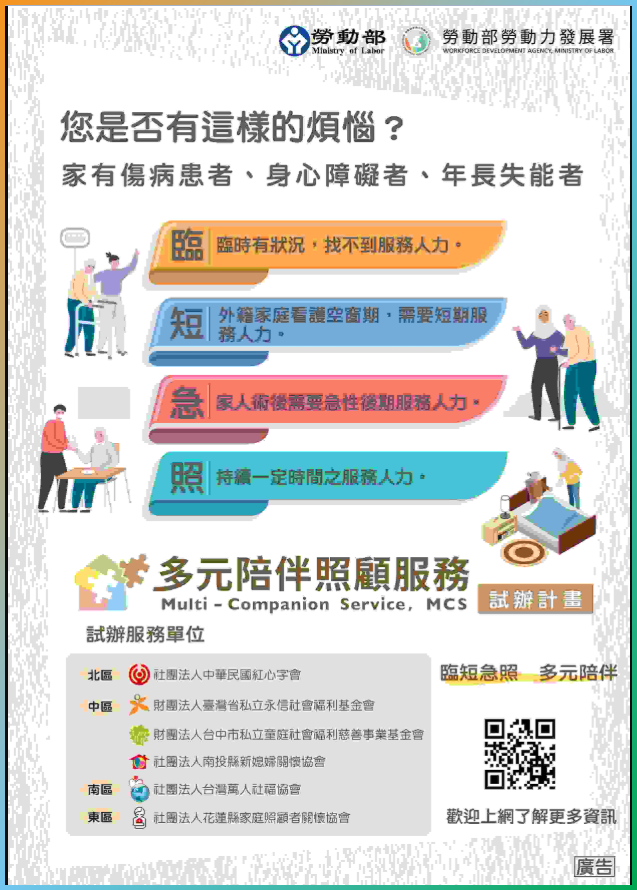

# 照顧服務
主管機關為台北市社會局老人福利科, `BD01-BD03`是給日照中心及家托單位之補助; `BD03`是補助接送個案居家到其他長照服務據點(含輔具中心)  

照顧服務含:
* [居家服務BA](#BA)
* [日間照顧BB](#BB)
* 家庭托顧BC
* 社區沐浴BD01(略)
* 社區晚餐BD02(略)
* 社區服務交通接送BD03(略)

## 居家服務BA
BA01-BA24, 居家照顧服務員固定時間到案家提供身體照顧，任務制，做完就會離開(無法整天，僅能提供部分時段，如有整天需求，可[參考-多元陪伴照顧服務試辦計畫](#參考-多元陪伴照顧服務試辦計畫)
### BA01 - 身體清潔

- 這不是BA07洗澡
- 1天可2組, 不可連續(早晚使用)
- 床上擦澡

### BA02 - 基本照顧

> 1/30mins, 限制3hrs

- 穿脫衣服等日常起居, 可和BA20 陪伴並用
	* 協助翻身
	* 移位
	* 上下床
	* 坐下
	* 離座
	* 刷牙洗臉, 洗手, 刮鬍子, 修剪指甲,  協助用藥, 服藥, 整理床, 更換床單, 
	* 穿脫衣服
	* 如廁
	* 更換尿片或衛生棉
	* 倒尿桶
	* 清洗便桶
	* 造廔袋清理
	* 或相關協助

### BA03 - 量測vital sign

- 因`疾病`需求的量測, 如果是洗澡前為了安全的理由不適用

### BA04 - 協助進食, 管灌

- `進食`的動作
- 訂外送, 免備餐僅進食
- 單純加熱

### BA05 - 餐食

- 從生煮到熟的過程

### BA07 - 洗澡洗頭

### BA08 - 足部照顧

- 要考證照

1.  DM
2.  問題指甲, 厚指甲
3.  龜裂

**三個都有才算**

### BA09 - 到宅沐浴車

### BA09a - 有留置管沐浴車

- 有護士評估vital sign

### BA10 - 翻身拍背
- 有操作指引(約15mins)
### BA11 - ROM

- 主動or被動
- 有操作指引
- 不會連續操作(間斷如2hrs可核定)

### BA12 - 協助上下樓梯
* 上下樓梯都算一次

### BA13 - 陪同外出

- 1/30mins
- 洗腎, "接"和"送", 定期復健可申請

### BA14 - 陪同就醫

- 1.5hrs內, 超過的話並用BA13

### BA15 - 家務協助
- 1/30mins
### BA 16 - 代購
* 5km以內
### BA 18 - 安全看視
* 限心智障礙者
### BA 20 - 陪伴
* 1支/30mins
### BA 23 - 洗頭
### BA 24 - 協助排泄
- 含腸造口更換(不含底座更換)
# 參考-多元陪伴照顧服務試辦計畫

2025.7.2更新

* 服務對象:
    * 時效內的身障證明
    * 重大傷病
    * 三個月內就醫或手術紀錄
    * 有看護的被照顧者
    * 長照失能等級2-8

為回應民眾「臨短急」服務需求，包括長輩「臨」時有狀況卻找不到服務人力、外籍家庭看護空窗期的「短」期需要服務人力、家人手術或病後需要「急」性後期服務等，勞動部推動「多元陪伴照顧服務試辦計畫」，由依法設立滿五年之財團法人或非營利社團法人，並通過公益性、專業度與合理收費等評選標準後成為試辦單位，聘僱及培訓本國籍及外國籍多元陪伴照顧服務工作者到申請服務家庭，提供基本日常生活服務、陪同外出、陪同就醫、安全陪伴等多元陪伴照顧服務 。「陪伴照顧服務工作者」之給薪與休息時間，依勞動基準法規定辦理。

本項服務由民眾全額自費，各試辦單位得提供單次至少四小時以上或全日等彈性服務，並依勞動部核定之服務價格收費。

## 日間照顧BB

