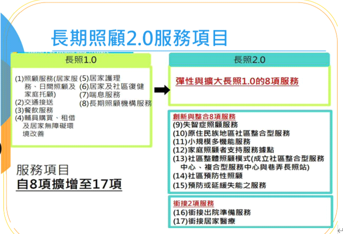
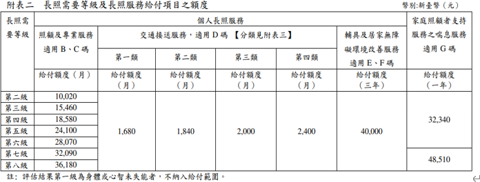

# 長照2.0服務項目

* 長照1.0

    1. 照顧服務-[轉跳到該章節](./長照2_0服務項目/1照顧服務.md)
        - 居服
        - 日照
        - 家托
    2. 交通接送
    3. 餐飲服務
    4. 輔具購買. 租借及居家無障礙設施
    5. 居家護理
    6. 居家及社區復健
    7. 喘息服務
    8. 長照機構服務

> 長照2.0增加及整合長照1.0的服務

* 長照2.0

    9. 失智症照顧
    10. 原住民地區社區整合服務
    11. 小規模多機能服務
    12. 家庭支持服務據點
    13. 社區整合照顧模式
        - 成立社區整合服務中心
        - 複合性服務中心
        - 巷弄長照站
    14. 社區預防照顧
    15. 預防或延緩失能之服務
    16. 出備服務(出院準備)
    17. 銜接居家醫療

# 給付額度及負擔比率

## 給付額度計算單位
* `照顧與專業服務`與`交通接送`以**月**為單位
* `輔具與居家無障礙環境改善服務`以**3年**為單位
* `喘息服務`以**年**為單位

> 有`外籍看護`及領取`特照津貼`, 僅給付額度的**30%**, 只能使用`專業服務`及`到宅沐浴車`

## 核定生效給付與留用規則
留用額度六個月為一期(系統有底色區分), 僅有照顧服務, 專業服務, 交通接送有留用

* 核定等級提高 
    * 給付額度回朔當月1日生效
    * 留用額度保留到當月底 
* 核定等級降低 
    * 給付額度次月1日生效
    * 留用額度保留到核定前一日為止 
     
## AA碼: 給長照服務單位的加給
AA碼不扣長照給付額度也不用部份負擔

* AA01- A單位家訪 1700元
* AA02- A單位電訪 400元
* AA12- 開立醫師意見書 居家失能個案家庭醫師照護方案
    * 半年醫師家訪一次, 該單位每個月電訪一次
* AA08- 晚間服務(2000-0000)
* AA09- 假日服務
    * 照專要勾選, 服務單位才能申請
> 同日AA08及AA09不能同時申請
